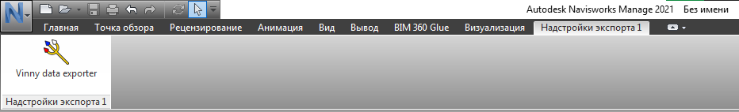

# VinnyNavisworksAdapter

Adapter for Autodesk Navisworks

# Установка

Файлы плагина к Autodesk Navisworks расположены в папке `plugins\navisworks` пакета `VinnyLibConverter`(см. [здесь](https://github.com/Vinny-Environment/VinnyLibConverter#%D1%83%D1%81%D1%82%D0%B0%D0%BD%D0%BE%D0%B2%D0%BA%D0%B0))

Ниже приведена таблица соответствия версий Autodesk Navisworks и версий плагина:

| Версия NW | Локальный путь    |
| --------- | ----------------- |
| 2021-2025 | `navisworks\2021` |
| 2026      | ?                 |

1. Зайти в папку с установленным Navisworks (папка, в корне которой лежит приложение `Roamer.exe`);

2. В папке `Plugins` создать папку `VinnyNavisworksLoader`;

3. Скопировать в созданную папку файлы `VinnyNavisworksLoader.dll`, `VinnyPath.txt` и папку `Resources` с файлами;

4. В файле `VinnyPath.txt` указать путь к `VinnyLibConverter` (куда вы распаковали набор библиотек);

Если всё сделано корректно, то в Navisworks после запуска на панели инструментов "Надстройки экспорта" появится иконка плагина

# Использование

Под экспорт попадают только видимые элементы (если Autodesk.Navisworks.Api.ModelItem.IsHidden = true, то элемент и вложенные в него не обрабатываются).
